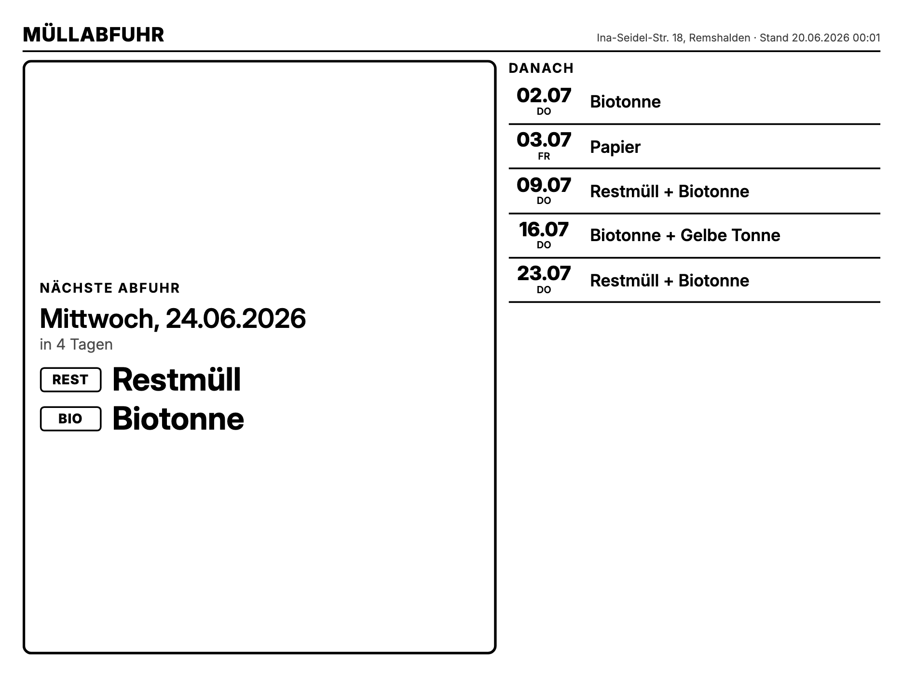

# TRMNL Private Plugin – Müllabfuhr Remshalden-Geradstetten

Zeigt auf einem **TRMNL X**-E-Ink-Display die nächsten Müllabfuhr-Termine für

> **Ina-Seidel-Straße 18, 73630 Remshalden (Ortsteil Geradstetten), Rems-Murr-Kreis**

mit großer Hervorhebung der nächsten Tonne und eindeutigen Badges **HEUTE** / **MORGEN**.



*(HEUTE-Zustand: der Hauptbereich wird invertiert – schwarzer Block, weiße Schrift –
für maximale Aufmerksamkeit auf E-Ink. Siehe `TRMNL_AWRM_ISS18/preview/half_vertical.png`.)*

---

## Architektur in einem Bild

```
transform/worker.js   ──►  GitHub Action (täglich)  ──►  public/awrm.json (raw-URL)
   holt & rechnet              .github/workflows/awrm.yml        │  TRMNL X pollt 1×/Tag
   (Filter, HEUTE/MORGEN,                                        ▼
    Zeitzone Berlin)                          TRMNL_AWRM_ISS18/markup/*.liquid
                                              (in die TRMNL-Felder kopiert) ──► E-Ink
```

Zwei getrennte Bausteine:

1. **Daten-Logik** – `transform/worker.js`: holt die awido/AWRM-Daten, filtert
   Ballast, fasst gleiche Tage zusammen, rechnet **HEUTE/MORGEN** in Zeitzone
   Europe/Berlin und über Jahresgrenzen. Läuft in der **GitHub Action**, die
   daraus täglich `public/awrm.json` erzeugt.
2. **Darstellung** – `TRMNL_AWRM_ISS18/markup/*.liquid`: die für den TRMNL X
   gebauten Layouts (Shared + 4 Views). Werden in die TRMNL-Plugin-Felder kopiert.

---

## 1. Datenquelle (verifiziert)

Betreiber: **AWRM – Abfallwirtschaft Rems-Murr AöR**. Der adressgenaue Abfallkalender
läuft technisch über **awido / CubeFour** (dieselbe Basis wie die Android-App
`com.webapp.rmk`). Die offizielle JSON-Schnittstelle liefert die Termine inkl.
bereits eingerechneter **Feiertagsverschiebungen** – es wird nichts selbst gerechnet.

**Finaler Daten-Endpunkt** (direkt im Browser testbar):

```
https://awido.cubefour.de/WebServices/Awido.Service.svc/secure/getData/3d6a2719-0000-0000-0000-000000000000?fractions=&client=rmk
```

| Parameter | Wert | Bedeutung |
|-----------|------|-----------|
| `client`  | `rmk` | Mandant Rems-Murr-Kreis |
| `oid` (Pfad) | `3d6a2719-0000-0000-0000-000000000000` | exakte Adresse: Remshalden → Ina-Seidel-Straße → Haus **18** |

Die OID wurde über drei offene awido-Aufrufe ermittelt (`getPlaces` → `getGroupedStreets`
→ `getStreetAddons`); kein Login/Captcha/Session nötig. Roh-Antworten zur
Nachvollziehbarkeit liegen unter [`research/`](research/). Referenz-Flow:
[`mampfes/hacs_waste_collection_schedule`](https://github.com/mampfes/hacs_waste_collection_schedule)
(`source/awido_de.py`, Mandant `rmk`).

### Abfallarten (Fraktionscodes der Quelle)

| Code(s) der Quelle | Anzeige | Badge |
|--------------------|---------|-------|
| `R2`,`R4`,`RC1`,`RC2` | Restmüll | `REST` |
| `BT` | Biotonne | `BIO` |
| `PT` | Papier | `PAP` |
| `GT` | Gelbe Tonne | `GELB` |
| `GG` | Grüngut | `GRÜN` |
| `CB` | Christbäume | `BAUM` |
| `KS` | Kartonagen | `KART` |
| `UM` | Umweltmobil | *(per `exclude=UM` ausgeblendet)* |

Mehrere Restmüll-Varianten am selben Tag werden zu einem Eintrag „Restmüll"
zusammengefasst.

### Ausgabe-JSON (Auszug)

```jsonc
{
  "address": "Ina-Seidel-Str. 18, Remshalden",
  "generated_at_human": "20.06.2026 08:15",
  "has_pickups": true,
  "next": {
    "date_human": "24.06.2026", "weekday": "Mittwoch", "weekday_short": "Mi",
    "days_until": 4, "relative": "in 4 Tagen",
    "is_today": false, "is_tomorrow": false, "is_soon": false,
    "badge": "",                         // "HEUTE" | "MORGEN" | ""
    "items": [ {"name":"Restmüll","tag":"REST"}, {"name":"Biotonne","tag":"BIO"} ],
    "items_text": "Restmüll + Biotonne"
  },
  "upcoming": [ /* nächste ~8 Termin-Tage, gruppiert */ ],
  "error": null
}
```

Vollständiges Beispiel: [`sample/output.json`](sample/output.json).

---

## 2. Daten bereitstellen – GitHub Action (aktiv)

Das Plugin pollt **eine URL**, die das anzeigefertige JSON liefert. Da `HEUTE`/`MORGEN`
und `in X Tagen` tagesaktuell sein müssen, erzeugt eine **GitHub Action** die Datei
täglich neu:

- Workflow: [`.github/workflows/awrm.yml`](.github/workflows/awrm.yml) (Cron `23 1 * * *`
  + Sicherheitslauf `23 3 * * *` ≈ 02:23/04:23 Berlin — bewusst früh, weil GitHub-Crons
  sich um Stunden verzögern können; zusätzlich manuell über *Actions → Run workflow*).
- Schritt: `node transform/worker.js > public/awrm.json`, danach Commit bei Änderung.
- Voraussetzung: *Settings → Actions → Workflow permissions → Read and write*.

**Polling-URL für TRMNL** (raw-URL der erzeugten Datei):

```
https://raw.githubusercontent.com/do4two/TRMNL_AWRM/main/public/awrm.json
```

> Alternative ohne GitHub: `transform/worker.js` als Live-Function deployen
> (Cloudflare Workers via `npx wrangler deploy`, oder Val.town). Dann entsteht die
> URL beim Deploy und die Werte werden bei jedem Abruf frisch berechnet – kein Cron nötig.
> Adresse/Verhalten per Query überschreibbar: `?oid=...&client=...&exclude=UM,KS&limit=8`.

Lokaler Testlauf des Transforms:

```bash
node transform/worker.js          # gibt das fertige JSON auf stdout aus (Live-Abruf)
```

---

## 3. TRMNL Private Plugin anlegen (Schritt für Schritt)

1. In TRMNL einloggen → **Plugins → Private Plugin → „New"**
   ([trmnl.com/plugin_settings/new?keyname=private_plugin](https://trmnl.com/plugin_settings/new?keyname=private_plugin)).
2. **Name**: z. B. „Müllabfuhr Remshalden".
3. **Strategy**: **Polling**. **Polling URL**: die raw-URL aus Abschnitt 2. Methode `GET`.
4. **Refresh-Intervall**: einmal täglich (12–24 h) genügt.
5. Speichern → **„Edit Markup"**. Den **kompletten Dateiinhalt** aus
   `TRMNL_AWRM_ISS18/markup/` in das jeweilige Feld kopieren:

   | Datei | TRMNL-Feld |
   |---|---|
   | `shared.liquid` | **Shared** |
   | `full.liquid` | **Full** |
   | `half_horizontal.liquid` | **Half horizontal** |
   | `half_vertical.liquid` | **Half vertical** |
   | `quadrant.liquid` | **Quadrant** |

6. Im Editor als **Gerät „TRMNL X"** prüfen (erst Full, dann die Mashups).
7. **Save** → Plugin einem **Playlist-Eintrag** zuweisen → **Force Refresh**.

> Bei der Polling-Strategie sind die Top-Level-Keys des JSON direkt in Liquid
> verfügbar (`{{ next.badge }}`, `{{ upcoming }}`, `{{ address }}` …).

---

## 4. Die vier Layouts (TRMNL X)

Das TRMNL X besitzt ein Panel mit **1872×1404 px** (logischer 1040×780-Canvas,
Skalierung 1,8). Die Layouts sind **responsiv** über `cqw/cqh` + `clamp()` und füllen
jeden View-Slot – Full wie Mashup. Details und die verbindliche Struktur:
[`TRMNL_AWRM_ISS18/readmefirst.md`](TRMNL_AWRM_ISS18/readmefirst.md).

| Layout | Inhalt |
|--------|--------|
| **full** | Großer Hero (nächste Abfuhr + HEUTE/MORGEN) **+** Liste „Danach" (5 Termine) |
| **half_horizontal** | Hero kompakt + 3 Folgetermine |
| **half_vertical** | Hero + 4 Folgetermine (gestapelt) |
| **quadrant** | Maximal reduziert: nur nächste Tonne + Datum |

E-Ink-tauglich: 1-bit Schwarz/Weiß, hoher Kontrast, große Schrift, dicke Rahmen.
Tonnen werden über **Text + Badge** unterschieden (REST/BIO/PAP/GELB/GRÜN …), nicht
über Farbe. HEUTE/MORGEN invertiert den Hero (schwarzer Block).

Gerenderte Vorschauen: [`TRMNL_AWRM_ISS18/preview/`](TRMNL_AWRM_ISS18/preview/)
(`full.png`, `full_today.png`, `half_horizontal.png`, `half_vertical.png`, `quadrant.png`).

---

## 5. Robustheit

- **Zeitzone**: „heute/morgen" wird strikt in **Europe/Berlin** bestimmt (`Intl`, DST-sicher).
- **Feiertage**: kommen fertig verschoben aus der Quelle.
- **Jahreswechsel**: Filter „≥ heute" + Sortierung über Jahresgrenzen (am 31.12. steht
  der 01.01. korrekt als „MORGEN").
- **Listenende / keine Termine**: `has_pickups: false` + `error`-Text; alle Layouts
  zeigen einen sauberen „Keine Termine"-Zustand.
- **Quelle nicht erreichbar**: gültiges JSON mit gesetztem `error` und leerer Liste –
  das Display bleibt funktionsfähig.

---

## 6. Lokale Vorschau / Tests

```bash
cd TRMNL_AWRM_ISS18
make check      # Struktur-Lint der vier Layouts + Shared
make preview    # rendert Shared+Markup mit ../sample-Daten → preview/*.html
```

`preview/render.mjs` injiziert Shared + Markup mit den Beispieldaten
(`sample/output.json` = Normalfall, `sample/output_today.json` = HEUTE) in die echte
Plattformstruktur (`screen--v2` / `view` / `mashup`) und erzeugt die `*.html`. Diese
direkt im Browser öffnen oder per Headless-Chrome screenshotten. `liquidjs` wird aus
`tools/node_modules` aufgelöst.

---

## 7. Projektstruktur

```
TRMNL_AWRM/
├─ transform/
│  ├─ worker.js          # Daten-Logik (Cloudflare/Val.town/Deno/Node)
│  ├─ wrangler.toml      # optionaler Cloudflare-Deploy
│  └─ package.json
├─ .github/workflows/
│  └─ awrm.yml           # erzeugt public/awrm.json täglich
├─ public/
│  └─ awrm.json          # Polling-Quelle (von der Action gepflegt)
├─ TRMNL_AWRM_ISS18/      # das TRMNL-X-Plugin (Markup + Preview)
│  ├─ markup/            # shared + full/half_horizontal/half_vertical/quadrant.liquid
│  ├─ preview/           # render.mjs + gerenderte HTML/PNG-Vorschauen
│  ├─ tests/             # check_structure.py
│  ├─ Makefile           # make check / make preview
│  └─ readmefirst.md     # verbindliche X-Struktur-Doku
├─ sample/               # output.json + output_today.json (Beispieldaten)
├─ tools/                # liquidjs (von preview/render.mjs genutzt)
├─ research/             # verifizierte Roh-Antworten der awido-API + TRMNL-Doku
└─ README.md
```

## 8. Hinweise

- **Kein Captcha/Login/Session** für die genutzten Endpunkte nötig (Stand der Verifikation).
  Sollte AWRM das ändern, ist das hier zu dokumentieren – nicht zu umgehen.
- Die Adress-OID ist ein impliziter „Snapshot" des awido-Bestands. Bei Adress-/
  Straßenumbenennung erneut über Abschnitt 1 auflösen.
