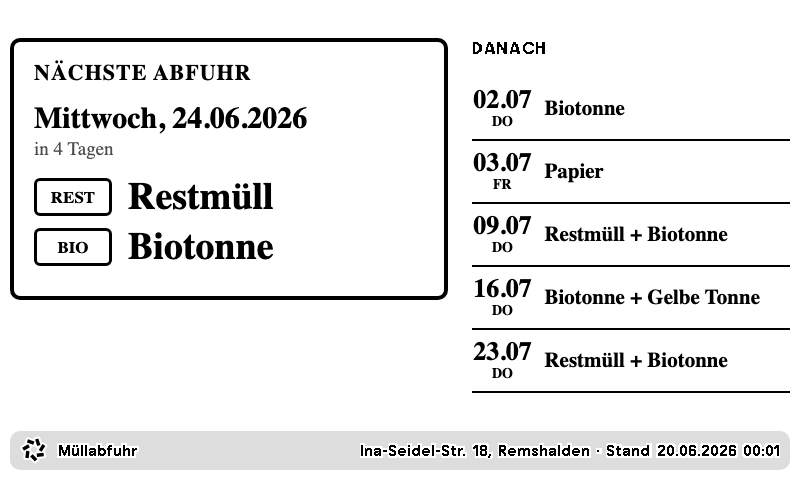

# TRMNL Private Plugin – Müllabfuhr Remshalden-Geradstetten

Zeigt auf einem TRMNL-E-Ink-Display die nächsten Müllabfuhr-Termine für

> **Ina-Seidel-Straße 18, 73630 Remshalden (Ortsteil Geradstetten), Rems-Murr-Kreis**

mit großer Hervorhebung der nächsten Tonne und eindeutigen Badges **HEUTE** / **MORGEN**.



*(HEUTE-Zustand: der Hauptbereich wird invertiert – schwarzer Block, weiße Schrift – für maximale Aufmerksamkeit auf E-Ink.)*

---

## 1. Datenquelle (verifiziert)

Betreiber: **AWRM – Abfallwirtschaft Rems-Murr AöR**. Der adressgenaue Abfallkalender
läuft technisch über **awido / CubeFour** (dieselbe Basis wie die Android-App
`com.webapp.rmk`). Die offizielle JSON-Schnittstelle liefert die Termine inkl.
bereits eingerechneter **Feiertagsverschiebungen** – es wird nichts selbst gerechnet.

**Finaler Daten-Endpunkt** (direkt im Browser testbar):

```
https://awido.cubefour.de/WebServices/Awido.Service.svc/secure/getData/3d6a2719-0000-0000-0000-000000000000?fractions=&client=rmk
```

| Parameter | Wert | Bedeutung |
|-----------|------|-----------|
| `client`  | `rmk` | Mandant Rems-Murr-Kreis |
| `oid` (Pfad) | `3d6a2719-0000-0000-0000-000000000000` | exakte Adresse: Remshalden → Ina-Seidel-Straße → Haus **18** |

### Wie die OID ermittelt wurde (Adressauflösung)

Die awido-API löst die Adresse in drei Schritten zu der `oid` oben auf. Alle Aufrufe sind
offen (kein Login, kein Captcha, keine Session nötig):

```
# 1) Gemeinden des Mandanten  → "Remshalden" = 009e4b71-...
GET .../getPlaces/client=rmk

# 2) Straßen der Gemeinde      → "Ina-Seidel-Straße" = 3d69fc21-...
GET .../getGroupedStreets/009e4b71-0000-0000-0000-000000000000?client=rmk

# 3) Hausnummern der Straße    → "18" = 3d6a2719-...   ← finale OID
GET .../getStreetAddons/3d69fc21-0000-0000-0000-000000000000?client=rmk
```

> Reference-Hilfe: Das Projekt
> [`mampfes/hacs_waste_collection_schedule`](https://github.com/mampfes/hacs_waste_collection_schedule)
> bildet AWRM als Awido-Mandant `rmk` bereits ab (`source/awido_de.py`) – daraus stammt der
> dokumentierte Aufruf-Flow. Roh-Antworten zur Nachvollziehbarkeit liegen unter [`research/`](research/).

### Abfallarten (Fraktionscodes der Quelle)

| Code(s) der Quelle | Anzeige im Plugin | Badge |
|--------------------|-------------------|-------|
| `R2`,`R4`,`RC1`,`RC2` | Restmüll | `REST` |
| `BT` | Biotonne | `BIO` |
| `PT` | Papier | `PAP` |
| `GT` | Gelbe Tonne | `GELB` |
| `GG` | Grüngut | `GRÜN` |
| `CB` | Christbäume | `BAUM` |
| `KS` | Kartonagen | `KART` |
| `UM` | Umweltmobil | *(standardmäßig ausgeblendet)* |

`UM` (Umweltmobil) ist eine mobile Schadstoff-Sammlung, zu der man hingeht – keine Tonne,
die man rausstellt. Sie wird per Default herausgefiltert (`exclude=UM`), damit der
„nächste Tonne"-Bereich nicht verfälscht wird. Mehrere Restmüll-Varianten am selben Tag
werden zu einem Eintrag „Restmüll" zusammengefasst.

---

## 2. Architektur – warum ein kleiner Transform (Option B)

Die rohe `getData`-Antwort ist **~697 KB** und enthält überwiegend Ballast (News, Kontakte,
Depots, App-Store-Links …). Sauberes Filtern, Sortieren, Zusammenfassen gleicher Tage,
Zukunfts-Filter sowie die **HEUTE/MORGEN-Logik in Zeitzone Europe/Berlin** sind in reinem
Liquid fragil bis unmöglich.

Deshalb: **ein minimaler, zustandsloser Serverless-Transform** ([`transform/worker.js`](transform/worker.js)),
der die awido-Daten holt und ein **~5 KB** großes, anzeigefertiges JSON ausliefert. TRMNL
pollt nur diese eine URL.

- **Kein dauerhaft laufender Server**, kein eigener Datenspeicher – eine reine Function
  (Cloudflare Workers / Val.town / Deno Deploy), die pro Abruf live die Quelle abfragt.
- Robust gegen **Jahreswechsel** und **Listenende** (siehe Abschnitt 6).

```
awido.cubefour.de  ──►  worker.js (Transform)  ──►  TRMNL (Polling, 1×/Tag)  ──►  E-Ink
   697 KB Roh-JSON        ~5 KB Anzeige-JSON          Liquid-Templates
```

### Ausgabe-JSON (Auszug)

```jsonc
{
  "address": "Ina-Seidel-Str. 18, Remshalden",
  "generated_at_human": "20.06.2026 08:15",
  "has_pickups": true,
  "next": {
    "date_human": "24.06.2026", "weekday": "Mittwoch", "weekday_short": "Mi",
    "days_until": 4, "relative": "in 4 Tagen",
    "is_today": false, "is_tomorrow": false, "is_soon": false,
    "badge": "",                         // "HEUTE" | "MORGEN" | ""
    "items": [ {"name":"Restmüll","tag":"REST"}, {"name":"Biotonne","tag":"BIO"} ],
    "items_text": "Restmüll + Biotonne"
  },
  "upcoming": [ /* nächste ~8 Termin-Tage, gruppiert */ ],
  "error": null
}
```

Vollständiges Beispiel: [`sample/output.json`](sample/output.json).

---

## 3. Transform deployen

Der Code ist ein Standard-`fetch`-Handler und läuft unverändert auf mehreren Plattformen.
**Empfehlung: Cloudflare Workers** (kostenlos, kein Kaltstart-Hosting nötig).

### Variante A – Cloudflare Workers (empfohlen)

```bash
cd transform
npm install            # zieht wrangler
npx wrangler login
npx wrangler deploy
```

Ergebnis ist eine URL wie `https://awrm-trmnl.<dein-subdomain>.workers.dev` – **diese URL**
kommt später ins TRMNL-Plugin. Vorher testen:

```bash
curl "https://awrm-trmnl.<dein-subdomain>.workers.dev" | head
```

### Variante B – Val.town (am schnellsten, ohne CLI)

1. Auf [val.town](https://val.town) einen neuen **HTTP Val** anlegen.
2. Inhalt von [`transform/worker.js`](transform/worker.js) hineinkopieren (das `export default { fetch }`
   wird direkt als HTTP-Handler erkannt).
3. Die vergebene `*.web.val.run`-URL verwenden.

### Variante C – lokal / Deno

```bash
cd transform
node worker.js            # gibt das fertige JSON auf stdout aus (Live-Abruf)
```

### Adresse / Verhalten anpassen (ohne Code-Editieren)

Alles per Query-Parameter (oder als Worker-`[vars]` in `wrangler.toml`) überschreibbar:

```
?oid=...&client=...&address=...&exclude=UM,KS&limit=8
```

Für eine **andere Adresse** die neue `oid` über die drei Aufrufe aus Abschnitt 1 ermitteln
und als `?oid=` anhängen.

---

## 4. TRMNL Private Plugin anlegen (Schritt für Schritt)

1. In TRMNL einloggen → **Plugins → Private Plugin → „New"** (oder direkt
   [trmnl.com/plugin_settings/new?keyname=private_plugin](https://trmnl.com/plugin_settings/new?keyname=private_plugin)).
2. **Name**: z. B. „Müllabfuhr Remshalden".
3. **Strategy**: **Polling** auswählen.
4. **Polling URL**: die Transform-URL aus Abschnitt 3 eintragen
   (z. B. `https://awrm-trmnl.<subdomain>.workers.dev`).
   Methode `GET`, keine Header nötig.
5. **Refresh / Polling-Intervall**: **einmal täglich** genügt völlig (z. B. alle 12–24 h).
   Die Termine ändern sich nicht häufiger.
6. Plugin speichern → **„Edit Markup"** öffnen. Dort gibt es vier Tabs:
   - **Full** → Inhalt von [`templates/full.liquid`](templates/full.liquid)
   - **Half Horizontal** → [`templates/half_horizontal.liquid`](templates/half_horizontal.liquid)
   - **Half Vertical** → [`templates/half_vertical.liquid`](templates/half_vertical.liquid)
   - **Quadrant** → [`templates/quadrant.liquid`](templates/quadrant.liquid)

   Jeweils den kompletten Dateiinhalt in den passenden Tab kopieren.
7. **Save** → das Plugin einem **Playlist-Eintrag** zuweisen. Fertig.

> Hinweis: Bei der Polling-Strategie sind die **Top-Level-Keys** des JSON direkt in Liquid
> verfügbar (`{{ next.badge }}`, `{{ upcoming }}`, `{{ address }}` …). Die Templates sind
> genau darauf ausgelegt.

---

## 5. Die vier Layouts

| Layout | Größe | Inhalt |
|--------|-------|--------|
| **full** | 800×480 | Großer Hauptbereich (nächste Abfuhr + HEUTE/MORGEN-Badge) **+** Liste „Danach" (5 Termine) |
| **half_horizontal** | 800×240 | Nächste Abfuhr kompakt + 3 Folgetermine |
| **half_vertical** | 400×480 | Nächste Abfuhr + 4 Folgetermine (gestapelt) |
| **quadrant** | 400×240 | Maximal reduziert: **nur nächste Tonne + Datum** |

E-Ink-tauglich: 1-bit Schwarz/Weiß, hoher Kontrast, große Schrift, dicke Rahmen.
Tonnen werden über **Text + Badge** unterschieden (REST/BIO/PAP/GELB/GRÜN …), **nicht über Farbe**.
HEUTE/MORGEN invertiert den Hauptbereich (schwarzer Block) für sofortige Erkennbarkeit.

Vorschauen: [`sample/preview/`](sample/preview/) (`full.png`, `full_today.png`,
`half_horizontal.png`, `half_vertical.png`, `quadrant.png`).

---

## 6. Robustheit

- **Zeitzone**: „heute/morgen" wird strikt in **Europe/Berlin** bestimmt (`Intl`, reine
  Kalenderdaten – DST-sicher).
- **Feiertage**: kommen fertig verschoben aus der Quelle; es wird nichts nachgerechnet.
- **Jahreswechsel**: Der Transform filtert „≥ heute" und sortiert über Jahresgrenzen hinweg
  (am 31.12. steht der 01.01. korrekt als „MORGEN"). Die `oid` ist stabil; sobald AWRM den
  neuen Jahreskalender veröffentlicht, liefert derselbe Endpunkt automatisch die neuen Termine.
- **Listenende / keine Termine**: Sind keine zukünftigen Termine mehr vorhanden, liefert der
  Transform `has_pickups: false` + `error`-Text; alle Templates zeigen dann einen sauberen
  „Keine Termine"-Zustand statt zu brechen.
- **Quelle nicht erreichbar**: Der Transform antwortet trotzdem mit gültigem JSON
  (`error` gesetzt, leere Liste) – das Display bleibt funktionsfähig.

Getestet (siehe Abschnitt 7): HEUTE/MORGEN-Badges, Jahresgrenze 2026→2027, UM-Ausschluss,
Restmüll-Zusammenfassung, leerer Kalender.

---

## 7. Lokale Vorschau / Tests

```bash
# 1) Anzeige-JSON aus Live-Daten erzeugen
cd transform && node worker.js > ../sample/output.json

# 2) Templates mit den Daten rendern (HTML nach sample/preview/)
cd ../tools && npm install        # einmalig (liquidjs)
cd .. && node tools/render.mjs
# dann sample/preview/*.html im Browser öffnen
```

---

## 8. Projektstruktur

```
TRMNL_AWRM/
├─ transform/
│  ├─ worker.js          # der Transform (Cloudflare/Val.town/Deno/Node)
│  ├─ wrangler.toml      # Cloudflare-Deploy-Config
│  └─ package.json
├─ templates/
│  ├─ full.liquid
│  ├─ half_horizontal.liquid
│  ├─ half_vertical.liquid
│  └─ quadrant.liquid
├─ sample/
│  ├─ output.json        # Beispiel-Anzeige-JSON
│  └─ preview/           # gerenderte HTML/PNG-Vorschauen
├─ tools/
│  └─ render.mjs         # lokaler Liquid-Renderer
├─ research/             # verifizierte Roh-Antworten der awido-API + TRMNL-Doku
└─ README.md
```

## 9. Hinweise

- **Kein Captcha/Login/Session** für die genutzten Endpunkte nötig (Stand der Verifikation).
  Sollte AWRM das künftig ändern, ist das hier zu dokumentieren – nicht zu umgehen.
- Die Adress-OIDs sind ein impliziter „Snapshot" des awido-Bestands. Bei einer Adress-/
  Straßenumbenennung erneut über Abschnitt 1 auflösen.
